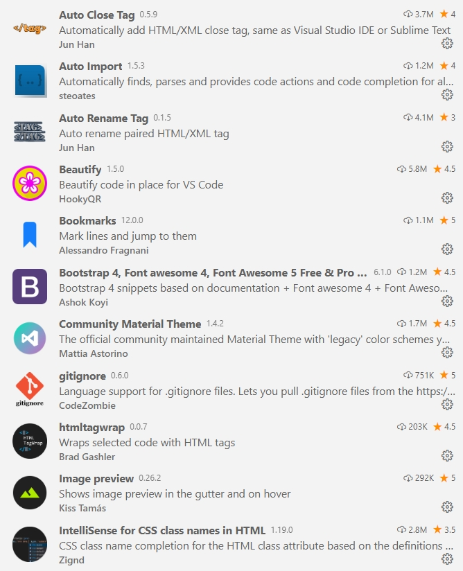
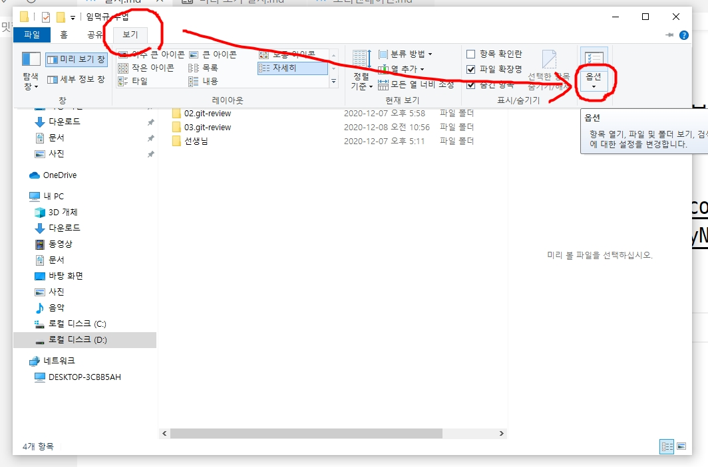
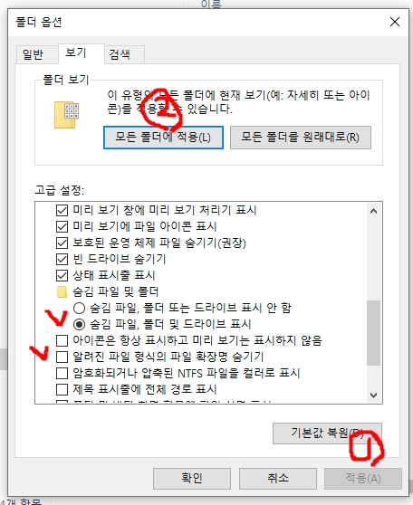
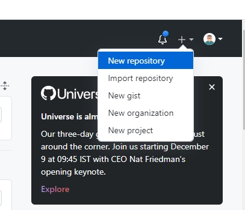
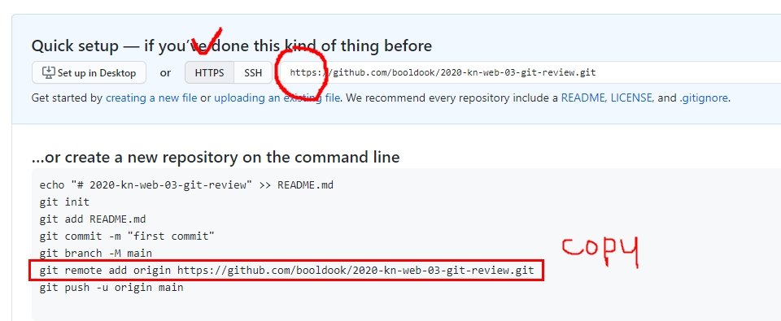

# 개발을 위한 초기 설치
## Git 세팅
### 한번만 설치 및 세팅
1. [깃 다운로드](https://git-scm.com) 페이지에서 우측 중앙의 컴퓨터를 클릭하여 다운로드 후 설치한다.
	- 설치된 프로그램은 컴퓨터 터미널창에서 git 명령을 사용할 수 있게 해준다.
2. [깃허브](https://github.com)에 접속하여 회원가입을 한다.
	- 회원가입시 이메일 인증을 꼭 해줘야 사용할 수 있다.
3. 시작버튼옆의 검색에서 cmd를 입력하여 터미널창을 열고 아래와 같이 코딩하고 실행한다.
```bash
# 가입시 사용한 아이디와 이메일
git config --global user.name 'userid'
git config --global user.email 'email@email.com'
```


## Visual Studio Code 세팅
### 다운로드 및 설치
1. [vscode 다운로드](https://code.visualstudio.com/download)하고 기본값으로 설치
2. 확장기능을 설치
	- 
	- 
3. 기능키
	- beautify: 코드정렬
		- 파일 > 기본설정 > 바로가기키
		- 검색창에 beautify 검색후
		- beautify file -> `ctrl`+`alt`+`l`
		- beautify selection -> `ctrl`+`alt`+`shift`+`l`
	- `ctrl`+`j` : 터미널창 열고 닫기
	- `ctrl`+`b` : 탐색창 열고 닫기
	- `alt`+`방향키 위,아래` : 코드 한줄 이동
	- `alt`+`shift`+`방향키 위,아래` : 코드 한줄 복사
	- `ctrl`+`/` : 한줄 주석
	- `alt`+`shift`+`a` : 여러줄 주석
	- [그 외 필요한 단축키들](https://blog.naver.com/PostView.nhn?blogId=jjjhygo91&logNo=221494454529&categoryNo=6&parentCategoryNo=0)

4. 파일설정
	
	

## Git을 사용해 보자
### 프로젝트 만들때 셋팅
1. 폴더를 만든다
2. 본인 깃허브에 로그인한다.
3. 우측 상단의 new repository 를 선택하여 새로운 저장소를 만든다.
	
4. 생성된 화면에서 아래사항을 진행한다
	
	- git init : 로컬(내컴퓨터)에 새로운 저장소를 만든다.
	- git remote add origin https://github.com/booldook/2020-kn-web-03-git-review.git : 내 로컬 저장소와 github의 저장소를 sync시킨다
	- git push -u origin main
5. vscode에서 만든 폴더를 연다
6. 탐색창에서 오른쪽버튼 클릭해서 README.md 파일을 생성한다


